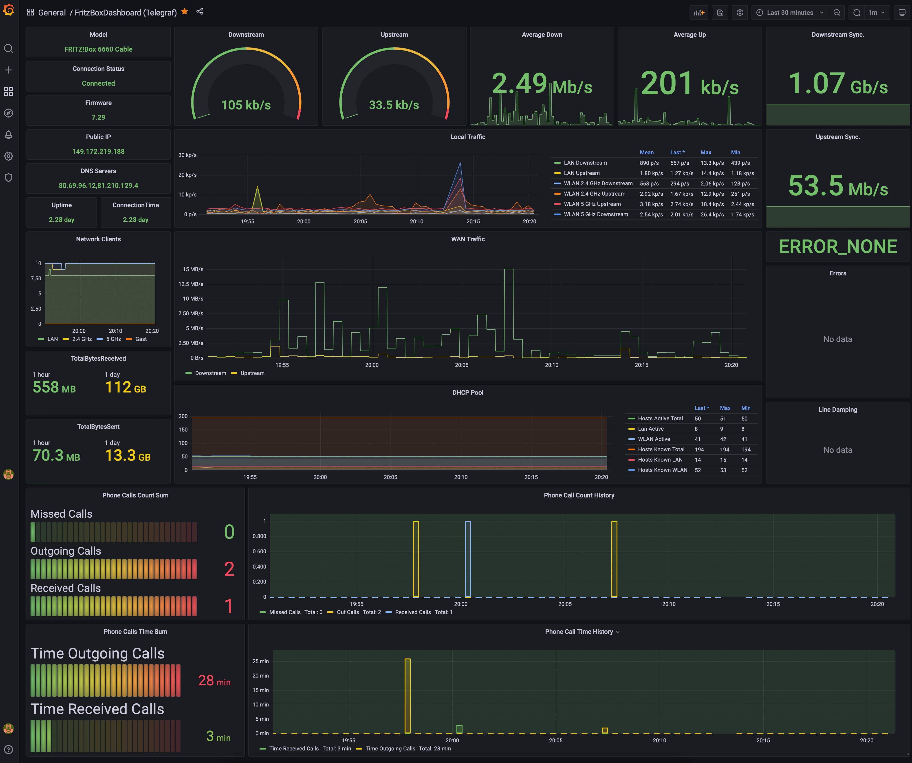

# Telegraf Fritz!Box Monitoring

This project contains a Python application to collect metrics from a Fritz!Box and push the monitoring data into a InfluxDB for visualization in Grafana.
For collecting the metrics, the [TR-064 protocol](https://avm.de/service/schnittstellen/) of AVM is used via the library [fritzconnection](https://github.com/kbr/fritzconnection).

This stack runs very well on a Raspberry Pi 4.
I've tested it with the 8GB version, but it should perform also with 4GB.
On a Raspberry Pi Zero W ist is also possible to let it run, but there it will be very slow after some days.

The basis of this project was [TelegrafFritzbox](https://github.com/Schmidsfeld/TelegrafFritzBox).
Since it is inactive and has some issues with cable routers, this project is a complete rewrite with some enhancements:

* Object-oriented codebase with smaller classes for better maintenance
* No configuration of cable/DSL routers required (system selects by itself)



# Compatibility
Any cable or DSL Fritz!Box routers should work without any special configuration.

The application was tested with:

* Fritz!Box 6660 Cable Router
* Fritz!Box 7412 DSL Router

This application uses also mostly the same names as [TelegrafFritzbox](https://github.com/Schmidsfeld/TelegrafFritzBox).
It allows reusing existing Grafana Dashboards without big changes.

# Output
* The output is formatted in the influxDB format. 
* By default the influxDB dataset FritzBox will be generated
* All datasets are tagged by the hostname of the router and grouped into different sources
* All names are sanitized (no "New" in variable names)
* All variables are cast into appropriate types (integer for numbers, string for expressions and float for 64bit total traffic)

## Install
### Prerequisites
* Telegraf, InfluxDB, Grafana is already installed
  * Install Guides:
    * [How to Install TIG stack (Telegraf, Influx and Grafana) on Ubuntu](https://onlyoneaman.medium.com/how-to-install-tig-stack-telegraf-influx-and-grafana-on-ubuntu-405755901ac2)
    * or
    * [How to Install TIG Stack (Telegraf, InfluxDB 2, and Grafana) on Ubuntu 22.04](https://www.howtoforge.com/how-to-install-tig-stack-telegraf-influxdb-and-grafana-on-ubuntu-22-04/)
* TR-064 protocol was activated in the Fritzbox:
  * `Heimnetz -> Netzwerk -> Netzwerkeinstellungen`
* Recommended: Have a dedicated user on the Fritz!Box (for example: fritz-mon)
* Clone the project to your server instance

### Installation
First clone the project and edit the file `telegraf_fritzbox.conf` to configure the Fritz!Box IP address.

Please have a look into the `Configuration` section to read more about the parameters and possibilities.

You need to install pip (Ubuntu example):
```bash
sudo apt install python3-pip
sudo pip3 install -r requirements.txt
sudo ./install.sh
```

The `install.sh` script sets the permission of the directory to the user/group `telegraf`.
If this is different on your installation, please change it in the script.

To check if everything is working, you can execute the `command` from the `telegraf_fritzbox.conf` file in your shell.
If everything is fine, it outputs data like this:

```
FritzBox,host=fritzbox7412,source=general ModelName="FRITZ!Box 7412 (UI)",Firmware="None",WANAccessType="None",SerialNumber="A31A141A332E"
FritzBox,host=fritzbox7412,source=status UpTime=4394708i,ConnectionStatus="Connected",LastError="ERROR_NONE"
...
```

If everything works, restart telegraf:
```bash
systemctl restart telegraf
```

Now you can import the Grafana Dashboard. It might be required to change the datasource, if the telegraf database is not the default datasource.

### Configuration

This application has some additional configurations.
The default settings are stored in the `config.yaml` file.
Be careful when editing this file, because it may be overwritten during an update.

To have a stable custom configuration, you can create a file `config_custom.yaml` in the same directory (e.g. `/opt/telegraf_fritzbox/config_custom.yaml`) and add your changes there.
The file `config_custom.yaml` is merged with the default configuration.
With this, it is only necessary to add the values you want to change.

Beside this configuration possibility you still have to configure the address of the Fritz!Box with the CLI parameter `-i <your ip address>`.

It is also possible to not use the YAML configuration and set up everything via CLI parameter.
To see which are available, please use the following command:

```bash
python3 telegraf_fritzbox.py -h
```

These options can be used for a preview directly with the script or they can be added to the `telegraf_fritzbox.conf` file.
Please aware, that this file will not be overwritten with the `install.sh` script.
If you want to change options, you have to do it at `/etc/telegraf/telegraf.d/telegraf_fritzbox.conf` file after you've started the `install.sh` script once.

